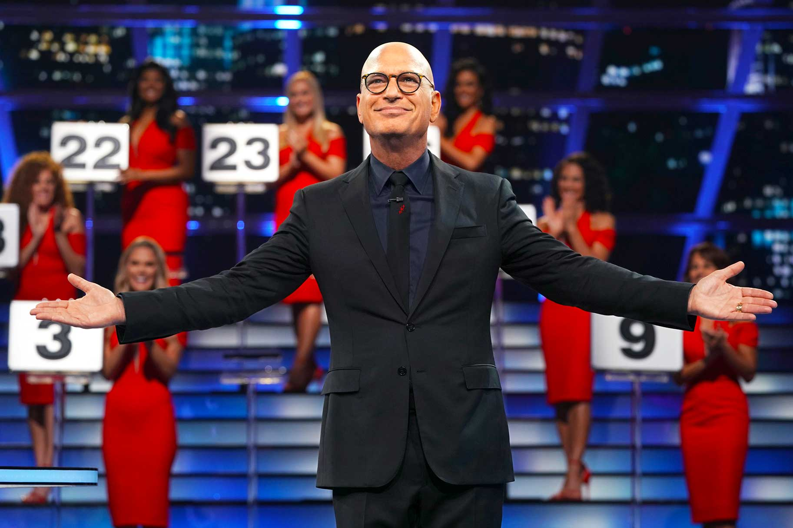
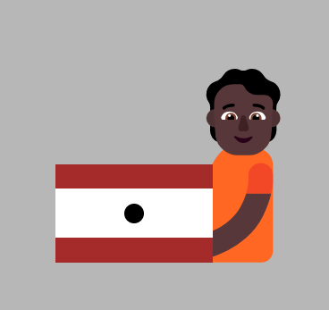
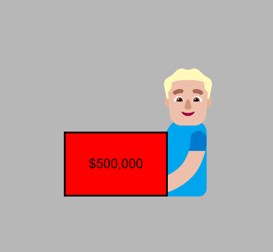

DEAL OR NO DEAL - Advanced

Play Link:
https://axercute.github.io/dealOrNoDeal/

Background:
Deal or No Deal is a high-stakes game show where luck, risk, and strategy collide. A contestant selects one sealed briefcase from a set of 26 (or fewer, depending on the version), each containing a hidden cash amount ranging from pocket change to a life-changing jackpot. As the game progresses, the contestant eliminates the remaining cases one by one, revealing their values and narrowing down the possibilities of what's inside their own chosen case.

At key points in the game, a mysterious figure known as "Bogdanoff" offers to buy the contestant's case for a certain sum based on the values still in play. The contestant must then make the ultimate decision: Deal — take the Banker's offer and walk away, or No Deal — keep playing in hopes of a bigger reward.

It’s a thrilling test of nerve and intuition, where every decision could mean walking away with thousands—or just a few dollars.

Idea: 
Deal or No Deal was originally created by Dick de Rijk, a Dutch television producer and writer. He developed the show in 2000 in partnership with Endemol, a Dutch production company known for creating international hit formats.

The show first aired in the Netherlands as Miljoenenjacht ("Hunt for Millions") and became a massive success. Its unique format was quickly adapted in countries around the world, with local hosts and tweaks to fit regional tastes. One of the most famous versions is the U.S. edition, hosted by Howie Mandel, which premiered in 2005.

How to play:
Traditional:
game_prize= [0.01,1,5,10,25,50,75,100,200,300,400,500,750,1000,5000,10000,25000,50000,75000,100000,200000,300000,400000,500000,750000,1000000] //26 cases

Game schedule:
Player picks a case for himself

Banker will offer every few cases opened
Every few cases opened are [6,5,4,3,2,1,1,1,1,1]

Last choice depend if the player wants to switch the final case

How to play:
Axercute_style:
game_prize= [1,5,10,15,30,50,75,100,150,250,500,1000,1500,3000,5000,7500,10000,15000,25000,50000,100000,150000,300000,50000,1000000] //25 cases

Game schedule:
Player picks a case for himself 

Banker will offer every few cases opened
Every few cases opened are [5,5,5,3,3,2]

Future development:

Emojis used as deal or no deal lady will be randomized:
🫃🫃🏻🫃🏼🫃🏽🫃🏾🫃🏿🫄🫄🏻🫄🏼🫄🏽🫄🏿🫄🏾

Case design:
one inner box, one outer box with grid separated in 3, middle with a circle.

Animation:
Case clicked before and after:

Challenges:
Setting up javascript function on creating element.
Making mistake of not making them a class first but ID
Mistake of not setting saved value for the generate function